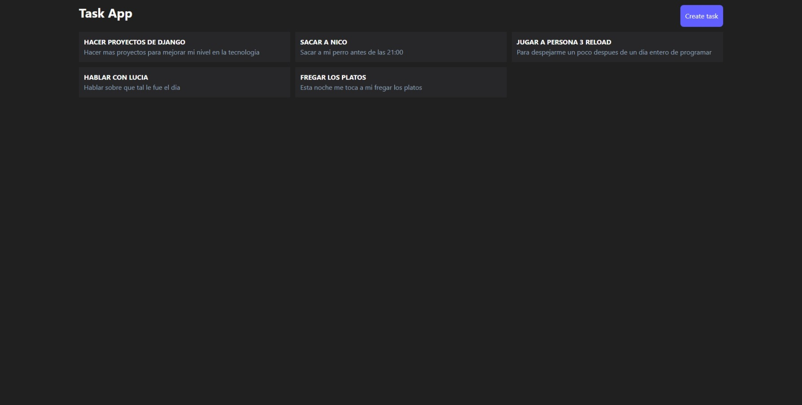
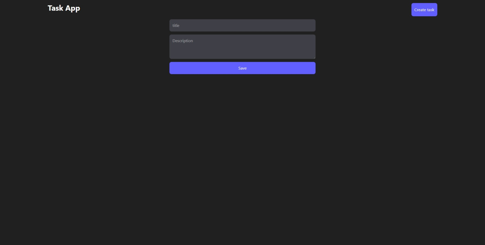
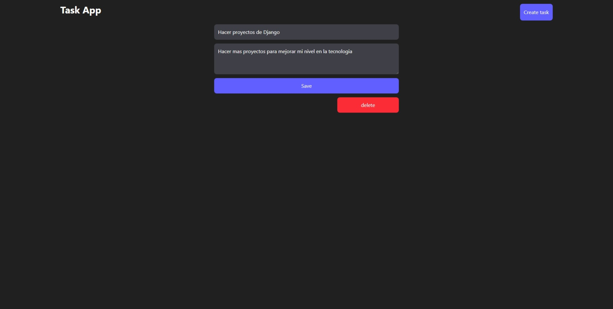

## ESP:

# Proyecto de Lista de tareas 📰🖊️

Una app para hacer una lista de tareas realizado con Django y Django REST Framework + React y tailwind

## 🎯 Objetivo del Proyecto

Aprender a como conectar el backend que en este caso sirve una api con el frontend con eventos, formularios y diseño moderno para el cliente

## 👁️ Vista previa del proyecto




## 🛠️ Estructura del Proyecto

El proyecto está organizado en varias carpetas y archivos para facilitar su mantenimiento y expansión:

Una carpeta **client** que corresponderá a la parte del frontend realizado con React y Tailwind. Se compone de varios componentes y varias paginas enrutado con React Router
Una carpeta **django_crud_react** con los settings principales para la parte del backend
Una carpeta **task** que corresponderá al modelo task y sus views

**requirements.txt**: Fichero que recoge los requerimientos que hacen falta para que el proyecto funcione adecuadamente. Se deberán instalar en un nuevo entorno virtual


## 🚀 Funcionalidades y uso
  
- **Agregar/Modificar/Borrar tareas**: Puedes añadir, modificar o borrar tareas
- **Enrutamiento**: Las paginas estan enrutadas con React Router
- **Manejo de API y documentacion**: Gracias a django rest framework documentation la api está documentada
- **Notificaciones de si se ha agregado, modificado o borrado una tarea**: Gracias a React hook toaster


## 🛠️ Instalación y Ejecución

1. Clona este repositorio:
   ```bash
   https://github.com/kaeedev/django_crud_react.git

2. Crea un entorno virtual en el proyecto para instalar las dependencias necesarias:
   ```bash
   python3 -m venv venv
   
   ```
   o
   ```bash
   python -m venv venv
   ```

3. Inicia el entorno virtual que has creado:
   ```bash
   source venv/bin/activate
  o en windows:
  ```bash
  venv\Scripts\activate
  ```

4. Instala las dependencias necesarias en la terminal del backend:
   ```bash
   pip install -r requirements.txt
   ```

5. Ejecuta el programa:
   Deberás runear el servidor local del backend en su terminal:
   ```bash
   python manage.py runserver
   ```
   Deberás luego runear el servidor local del frontend en su terminal:
   ```bash
   cd client
   npm run dev

## 📝 Licencia

Este proyecto está disponible únicamente para uso **docente** y con fines de aprendizaje.

### Condiciones:
- El código fuente de este proyecto puede ser usado, modificado y distribuido solo con fines educativos.

Si tienes alguna duda o quieres utilizar algún recurso de este proyecto, por favor contacta conmigo.
